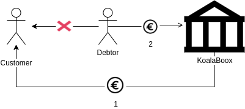

## The problem

Our company acts as an intermediary between businesses (the customer) and their clients (the debtor).  We provide immediate payment to the customer and collect from the debtor at a future date.  This type of loan is known as factoring.  

Before we can provide such a loan, we must validate that both the customer and the debtor meet certain eligibility criteria.  Write a set of classes and test cases to determine whether we can provide factoring to a given customer / debtor.  The rules are as follows:

- We can't provide factoring for more than 15% of a single customers average monthly revenue.
- Each debtor has a fixed limit -- €50,000 -- on the total amount they can owe to us at any time.
- No factoring is allowed for debts owed by subsidiaries to their parent companies
- KoalaBoox has a global lending limit of €70,000 

Please adapt and complete the code begun in [FactoringTest.php](/tests/FactoringTest.php) Some notes:

- Please don't use any database.  Keep everything in memory.  You can fetch data about the companies from [/tests/data.yml](/tests/data.yml)
- The test code and the FactoringService class are only there to make the goals of this exercise clear.  Feel free to modify 
  in any way you see fit, or to get rid of them all together.
- The focus of this test is object design -- while this problem could probably be resolved in a short block of code, 
  we're looking for something adaptable and extensible.
- You can use a framework, if you want to, but it isn't required, and our evaluation will focus on your solution to the 
  business problem